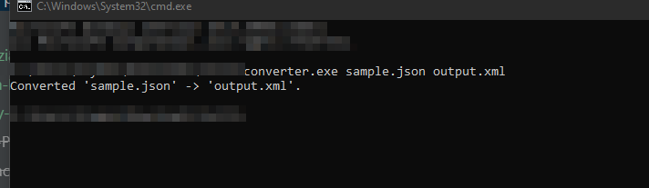

# Format Converter

Convert data files between **JSON**, **XML**, and **YAML** formats.

## Usage (CLI)

```
converter.exe <input> <output>
```

**Supported extensions:** `.json` `.xml` `.yml` `.yaml`



## Usage (GUI)

Double-click **converter_ui.exe** for a graphical interface — no terminal needed.

## Supported conversions

| From \ To | JSON | XML | YAML |
|-----------|------|-----|------|
| JSON      | —    | ✓   | ✓    |
| XML       | ✓    | —   | ✓    |
| YAML      | ✓    | ✓   | —    |

## Download

Pre-built executables are available under [Actions → Artifacts](../../actions).

## Build from source

```powershell
.\installResources.ps1
pyinstaller --onefile converter.py
pyinstaller --onefile --noconsole converter_ui.py
```
